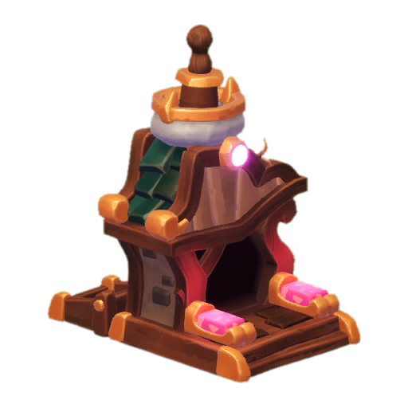
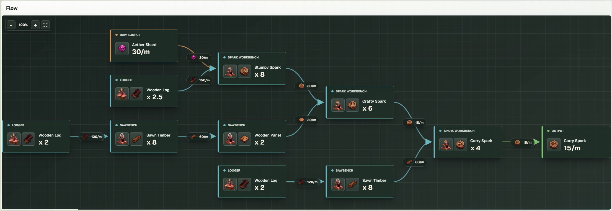
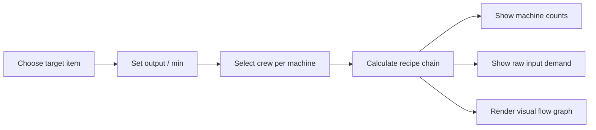

<div align="center">
  
  <h1>Sparkulator</h1>
  <p>
    A visual production calculator for
    <a href="https://store.steampowered.com/app/1817800/Oddsparks_An_Automation_Adventure/">Oddsparks: An Automation Adventure</a>.
  </p>

  <p>
    
    
    
    
    
  </p>
</div>

---

## What It Does

Sparkulator turns Oddsparks crafting chains into a clear production plan. Pick an item, set the desired output per minute, choose the Sparks working each machine, and the app calculates the machine counts, recipe flow, and raw input demand needed to keep that target running.

It is built for players who want to design cleaner automation layouts without doing repeated rate math by hand.

## Main Feature

<div align="center">
  
</div>

The interactive flow graph is the centerpiece: zoom with the mouse wheel, drag the canvas with left click, jump into fullscreen, and inspect every machine, resource rate, and output step in one view.

<div align="center">
  <table>
    <tr>
      <td align="center"><br />Raw Inputs</td>
      <td align="center"><br />Machines</td>
      <td align="center"><br />Crew Speed</td>
      <td align="center"><br />Target Output</td>
    </tr>
  </table>
</div>

## Highlights

- Interactive production graph with zoom, drag-to-pan, fullscreen, and resource-rate edges.
- Machine count summary for every workstation in the selected plan.
- Raw demand breakdown in items per minute.
- Crew presets for Stumpy and Crafty Spark combinations.
- Recipe rule selection for items with multiple production paths.
- English and German UI switch.
- Recipe and item links back to the Oddsparks wiki.

## Planning Flow



## Example Use Cases

- Find out how many Sawbenches and Wood Workshops are needed for a steady Wooden Panel line.
- Compare Stumpy and Crafty crew setups before rebuilding a factory section.
- Trace the upstream material demand for Spark crafting.
- Keep wiki recipe data close while planning an automation build.

## Tech Stack

Sparkulator is a client-side Next.js app using React, TypeScript, Tailwind CSS, and local Oddsparks item artwork stored in `public/oddsparks`.

```text
app/page.tsx          Main calculator UI, recipe data, and flow graph
app/globals.css       Visual theme and shared surfaces
public/oddsparks/     Item and workstation artwork
```

## Getting Started

Install dependencies and start the development server:

```bash
npm install
npm run dev
```

Then open:

```text
http://localhost:3000
```

## Available Scripts

```bash
npm run dev      # Start the local development server
npm run build    # Create a production build
npm run start    # Run the production server
npm run lint     # Run ESLint
```

## Data Source

The calculator currently uses recipe data and wiki links embedded in the app, based on the public Oddsparks wiki:

[oddsparks.wiki.gg](https://oddsparks.wiki.gg)

## License

Sparkulator is released under the [MIT License](LICENSE).
